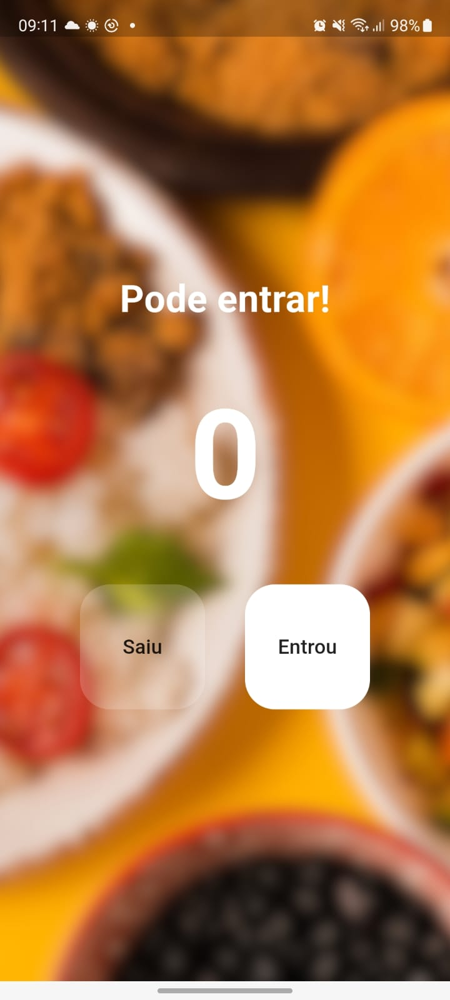
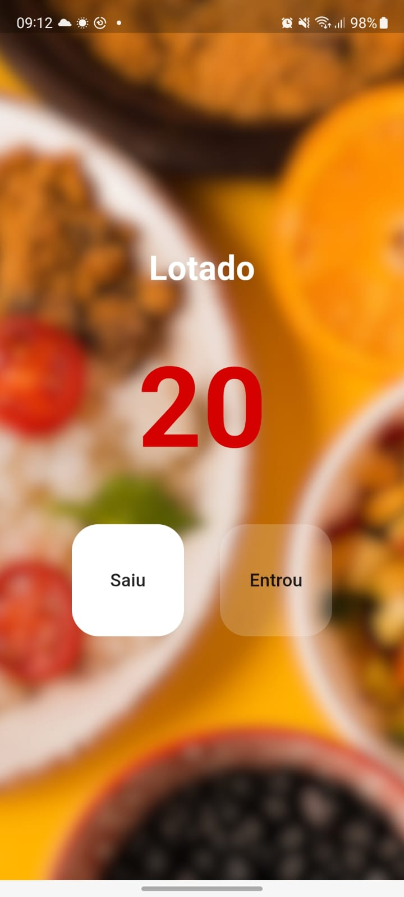

# Contador

Meu primeiro projeto Flutter.

## Entenda o app:

Durante a pandemia, a capacidade de controlar o número de pessoas em um ambiente se tornou crucial para manter a segurança e a saúde pública. Um aplicativo contador pode desempenhar um importante papel nesse contexto ao fornecer uma maneira prática e eficiente de monitorar a ocupação de espaços em tempo real. 

Com esse app, os responsáveis por um local podem garantir que o limite de pessoas permitidas não seja excedido, ajudando a cumprir as diretrizes de distanciamento social e evitando aglomerações. Além disso, o aplicativo pode fornecer notificações instantâneas quando a capacidade máxima estiver próxima de ser atingida, permitindo ações rápidas para dispersar ou restringir a entrada de mais pessoas. 

Assim, em tempos de pandemia um aplicativo contador não só facilita o gerenciamento de espaços, mas também contribui significativamente para a segurança coletiva, reduzindo os riscos de contágio e ajudando na prevenção da propagação do vírus.

## Imagens do app:

